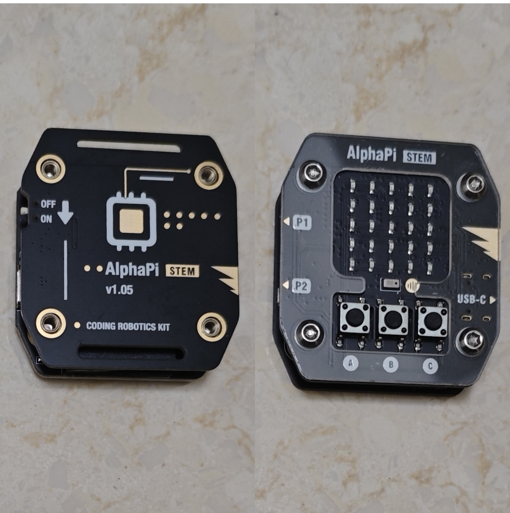

# AlphaPi STEM 蓝牙翻页器（Arduino IDE 版本）

**固件版本：V1.0.4**

## 项目说明

AlphaPi STEM 是国内开源ESP32微型嵌入式开发板，主打 MicroPython，面向 STEM 教学、硬件 DIY、物联网小项目
这是 AlphaPi Zero/AlphaPi STEM蓝牙翻页器的 Arduino IDE 版本，基于 ESP32-C3 开发。支持 6 种蓝牙键位模式（含自定义键值模式）、1 种 KOReader WiFi 控制模式（支持STA/AP双模式）和 8 种内置小游戏，可通过摇晃设备翻页，支持 Web 配置和休眠省电。

**项目地址：** https://github.com/shj4588/AlphaPi_STEM-PageTurner

<p align="center">
  
</p>

## V1.0.4 更新说明

- 🎨 **图标显示优化**：修复 KO 模式开机和切换时显示多余菱形图标的问题，优化模式切换逻辑，避免图标闪烁
- ⚙️ **新增最大摇晃时长参数**：可设置最大摇晃时长（200-5000ms），超过该时长的摇晃判定为误操作，不触发翻页，有效减少误触发
- 🖥️ **Web 配置页优化**：页面顶部增加"保存配置并重启"按钮，和底部按钮风格统一，不用滚到底部就能保存重启

## 功能特性

- ✅ 6 种蓝牙键位模式（PageUp/Down、方向键、音量、上下曲、播放控制、自定义键值）
- ✅ KOReader 模式（通过 WiFi HTTP 请求控制 KOReader 电子书阅读器）
  - STA模式：连接路由器，手机和翻页器在同一局域网
  - AP模式：手机直连翻页器热点，不需要路由器，IP固定192.168.4.2
  - 长按A一键切换STA/AP模式，秒切无延时
- ✅ 8 种内置小游戏（贪吃蛇、接球、摇色子、秒表、井字棋、像素鸟、赛车避障、俄罗斯方块）
  - 同时长按B+C进入/退出游戏模式
  - 游戏模式自动关闭蓝牙WiFi，屏幕常亮
  - 长按A切换游戏，长按B重新开始
  - 每个游戏可在Web页面单独开关
- ✅ WiFi/蓝牙按模式智能切换
- ✅ 摇晃翻页（3次取中位数 + 两种检测模式 + 3状态机）
  - 模式0：三轴差值之和（原模式）
  - 模式1：各轴独立阈值，阈值为0时忽略该轴
  - 可配置最小/最大摇晃时长，超过最大时长判定为误操作
  - Web页面可实时显示X/Y/Z轴加速度数值（采样率500ms）
- ✅ 长按 B 开关摇晃翻页功能
- ✅ 长按 C 对调翻页方向（play 模式下不生效）
- ✅ play 模式下摇晃只触发播放暂停
- ✅ 短按 A 切换翻页箭头显示开关
- ✅ 模式启用/关闭（Web 页面配置，关闭后切换时跳过）
- ✅ 休眠功能（可配置时长，单击任意按键唤醒，游戏模式也遵守）
- ✅ Web 配置页面（摇晃参数、模式启用、游戏开关、休眠时间、WiFi STA、KOReader 配置）
  - 页面顶部和底部都有"保存配置并重启"按钮，操作更方便
- ✅ AP 热点 1 分钟无设备连接自动关闭
- ✅ AP 有设备连接时不进入休眠
- ✅ 5x5 LED 点阵屏幕显示各模式图标和状态

## 硬件参数

| 组件 | 参数 |
|------|------|
| 主控 | ESP32-C3 |
| 点阵屏幕 | 5x5 LED，UART1，波特率 460929，TX=GPIO8, RX=GPIO9 |
| 加速度计 | SC7A20，SoftI2C，地址 0x18，SDA=GPIO6, SCL=GPIO7 |
| 按键 A | GPIO10，下拉输入，按下高电平 |
| 按键 B | GPIO1，下拉输入，按下高电平 |
| 按键 C | GPIO3，下拉输入，按下高电平 |

## 按键功能

| 按键 | 短按 | 长按 |
|------|------|------|
| A 键 | 切换翻页箭头显示开关 | 切换键位模式（蓝牙模式间循环）；KOReader模式下切换STA/AP模式 |
| B 键 | 下一页/下一曲/音量+（受方向对调影响） | 开关摇晃翻页功能 |
| C 键 | 上一页/上一曲/音量-（受方向对调影响） | 对调翻页方向（play 模式下不生效） |
| A+B 同时长按 | - | 切换到/离开 KOReader 模式 |
| B+C 同时长按 | - | 进入/退出游戏模式 |

### 游戏模式按键
| 按键 | 功能 |
|------|------|
| 长按 A | 切换游戏（循环，跳过被关闭的游戏） |
| 长按 B | 重新开始当前游戏 |
| 短按 A/B/C | 控制当前游戏（各游戏按键映射不同） |

## 模式说明

### 蓝牙模式（6种，可在 Web 页面启用/关闭）

| 模式 | B 键（短按） | C 键（短按） | 摇晃触发 |
|------|-------------|-------------|---------|
| page | PageDown（下一页） | PageUp（上一页） | 同按键 |
| arrow | Right（右） | Left（左） | 同按键 |
| media | 音量+ | 音量- | 同按键 |
| music | 下一曲 | 上一曲 | 同按键 |
| play | 停止 | 播放暂停 | 只触发播放暂停 |
| custom | 自定义键值（Web配置） | 自定义键值（Web配置） | 同按键 |

> **custom自定义模式**：B键和C键短按发送的HID键值可在Web配置页面自由设置（十进制HID Usage ID），默认B=PageDown(78)，C=PageUp(75)。支持组合键（最多3个键同时按），支持键盘键和媒体键两种类型。常用键值：Space=44, Enter=40, Esc=41, Tab=43, Left=80, Right=79, Up=82, Down=81。模式图标：字母U。B键短按显示字母B，C键短按显示字母C。

### KOReader 模式（WiFi 控制，支持STA/AP双模式）

- 通过 WiFi HTTP 请求控制 KOReader 电子书阅读器
- 进入此模式后自动关闭蓝牙，开启 WiFi
- 模式图标：居中的字母 K（STA模式），小一点的字母 K（AP模式）
- B 键下一页，C 键上一页（受方向对调影响）
- 摇晃也可翻页
- **长按 A 键切换 STA/AP 模式（秒切无延时）**
- 同时长按 A+B 返回到之前的蓝牙模式

#### STA模式（默认，连接路由器）
- 翻页器和手机连接同一个WiFi路由器
- 目标IP和端口在Web配置中设置
- 适合在家/办公室有路由器的场景

#### AP模式（手机直连，不需要路由器）
- 手机直接连接翻页器的WiFi热点 "AlphaPi-Config"
- 手机自动获取IP 192.168.4.2
- 翻页器固定向 192.168.4.2 发送HTTP命令
- AP模式端口可在Web配置中单独设置（默认8080）
- 适合出门在外没有路由器的场景
- 切换AP模式只是改变HTTP命令目标IP，不重新配置WiFi，秒切

### 游戏模式（8种内置小游戏）

- 同时长按 B+C 进入/退出游戏模式
- 进入游戏模式自动关闭蓝牙和WiFi，屏幕常亮
- 退出游戏模式恢复原来的模式和WiFi/蓝牙状态
- 游戏模式遵守自动休眠逻辑
- 长按 A 切换游戏（循环，跳过被关闭的游戏）
- 长按 B 重新开始当前游戏
- 每个游戏可在Web页面单独开关

#### 游戏列表
| 编号 | 游戏 | 控制方式 | 说明 |
|------|------|----------|------|
| 0 | 贪吃蛇 | A顺时针，B暂停，C逆时针 | 穿墙模式，速度随分数加快 |
| 1 | 接球 | A左移，B硬降，C右移 | 1像素接球板，速度随分数加快 |
| 2 | 摇色子 | 摇动设备或任意键 | 标准色子1-6点，灵敏度阈值3000 |
| 3 | 秒表 | A开始/继续，B暂停，C重置 | 精确到0.1秒 |
| 4 | 井字棋 | A横向移动，B落子，C纵向移动 | 9个位置落子，3子连珠获胜，玩家常亮AI闪烁 |
| 5 | 像素鸟 | A上升，B暂停，C下降 | 不自动下落，间隙1-3格随机 |
| 6 | 赛车避障 | A左切，B暂停，C右切 | 3车道，速度随分数加快 |
| 7 | 俄罗斯方块 | A左移，B旋转，C右移 | 2x2简化版，5种形状含L形，穿墙模式 |

## 摇晃检测

### 轴方向定义
设备水平放置、屏幕朝上时：
- **X轴**：长边方向
- **Y轴**：短边方向
- **Z轴**：高度方向（垂直于屏幕）

### 两种检测模式

#### 模式0：三轴差值之和（原模式，默认）
- total = abs(dx) + abs(dy) + abs(dz)
- total 超过摇晃阈值即算摇晃中
- 适合通用摇晃检测

#### 模式1：各轴独立阈值
- 任一轴的差值超过对应阈值即算摇晃中
- 阈值设为0时忽略该轴
- 适合只需要特定方向摇晃检测的场景（比如只检测左右摇晃）

### 算法
- 3 次读取取中位数过滤噪声
- 3 状态机：IDLE → SHAKING → WAIT_QUIET
- 摇晃结束后静止一段时间才触发翻页，避免一次摇晃触发多次

### 默认参数
| 参数 | 默认值 | 说明 |
|------|--------|------|
| 检测模式 | 0（三轴差值之和） | 0=三轴之和，1=各轴独立阈值 |
| 摇晃阈值 | 3000 | 三轴差值之和超过此值算摇晃中（仅模式0，范围500-50000） |
| X轴阈值 | 1000 | X轴差值超过此值算摇晃中（仅模式1，0=忽略此轴，范围200-30000） |
| Y轴阈值 | 1000 | Y轴差值超过此值算摇晃中（仅模式1，0=忽略此轴，范围200-30000） |
| Z轴阈值 | 1000 | Z轴差值超过此值算摇晃中（仅模式1，0=忽略此轴，范围200-30000） |
| 最小摇晃时长 | 100ms | 摇晃至少持续这么久才算有效摇晃 |
| 静止时长 | 300ms | 摇晃结束后静止这么久才触发翻页 |
| 冷却时间 | 1000ms | 触发翻页后经过冷却时间才能再次触发 |

### 状态显示
- 摇晃开启：波浪线图标
- 摇晃关闭：叉号图标
- 方向对调：圆圈图标
- BLE 未连接时摇晃：显示等待图标（菱形）
- 翻页箭头/音量/播放图标：显示 500ms 后自动熄灭
- 模式切换/功能开关图标：显示 2 秒后自动熄灭

## 休眠功能

- 默认 2 分钟无操作进入休眠（可在 Web 页面配置，最低 30 秒，0=不休眠）
- 进入休眠前闪烁 2 次 X 图标提示
- 使用 ESP32 真正的轻量级睡眠（`esp_light_sleep_start()`），最大程度省电
- 休眠时关闭屏幕、蓝牙、WiFi，系统完全暂停
- 通过 GPIO 唤醒：单击 A/B/C 任意按键即可唤醒（高电平触发）
- 唤醒后自动重新初始化屏幕（UART）、加速度计（I2C）、蓝牙/WiFi
- 唤醒后显示当前模式图标 2 秒，然后正常工作
- AP 有设备连接时不进入休眠（确保 Web 配置稳定）

## Web 配置

### 连接方式
1. 设备开启后（koreader 模式或手动开启 AP），手机连接 WiFi 热点 "AlphaPi-Config"
2. 浏览器访问 192.168.4.1

### 可配置项
1. **WiFi STA 设置（用于 KOReader 模式）**
   - WiFi SSID
   - WiFi 密码
   - 当前 STA 连接状态显示

2. **KOReader 设置**
   - KOReader IP 地址（STA模式）
   - KOReader 端口（STA模式，默认 8080）
   - KOReader 端口（AP模式，默认 8080，可单独设置）
   - 下一页 HTTP 指令（默认 GotoViewRel/1）
   - 上一页 HTTP 指令（默认 GotoViewRel/-1）
   - AP模式下IP固定为192.168.4.2，端口可单独设置
   - 查看所有 KOReader 指令的方法说明

3. **摇晃检测设置**
   - 启用/关闭摇晃
   - 检测模式选择（三轴差值之和 / 各轴独立阈值）
   - 摇晃阈值（500-50000，仅模式0有效）
   - X轴阈值（0=忽略此轴，200-30000，仅模式1有效）
   - Y轴阈值（0=忽略此轴，200-30000，仅模式1有效）
   - Z轴阈值（0=忽略此轴，200-30000，仅模式1有效）
   - 最小摇晃时长（50-500ms）
   - 静止时长（100-1000ms）
   - 摇晃冷却时间（>=500ms）
   - **加速度实时数值显示**（开启后实时显示X/Y/Z轴数值，采样率500ms）

4. **休眠设置**
   - 休眠超时时间（>=30秒，0=不休眠）
   - 进入休眠前闪烁2次X图标提示
   - 单击A/B/C任意按键即可唤醒
   - AP有设备连接时不进入休眠

5. **模式启用设置**
   - Page 模式启用/关闭
   - Arrow 模式启用/关闭
   - Media 模式启用/关闭
   - Music 模式启用/关闭
   - Play 模式启用/关闭
   - Custom 自定义模式启用/关闭
   - 关闭的模式在长按 A 切换时会跳过

6. **自定义模式键值设置**
   - B键短按发送的HID键值（十进制，默认78=PageDown）
   - C键短按发送的HID键值（十进制，默认75=PageUp）
   - 支持组合键（最多3个键同时按）
   - 支持键盘键和媒体键两种类型
   - 常用键值参考：Space=44, Enter=40, Esc=41, Tab=43, Left=80, Right=79, Up=82, Down=81, PageUp=75, PageDown=78
   - Web页面提供完整HID键值表参考

7. **游戏开关设置**
   - 贪吃蛇、接球、摇色子、秒表、井字棋、像素鸟、赛车避障、俄罗斯方块
   - 每个游戏可单独启用/关闭
   - 关闭的游戏在长按 A 切换时会跳过

### KOReader 常用 HTTP 指令
- 翻页：GotoViewRel/1（下一页）、GotoViewRel/-1（上一页）
- 亮度：IncreaseFlIntensity/5（加亮度）、IncreaseFlIntensity/-5（减亮度）
- 夜间：ToggleNightMode（切换夜间模式）
- 书签：ToggleBookmark（添加/删除书签）
- 字体：IncreaseFontSize（增大字号）、DecreaseFontSize（减小字号）
- 查看所有指令：浏览器访问 http://<KOReader IP>:<端口>/koreader/event/

## 文件结构

```
AlphaPi_PageTurner/
├── AlphaPi_PageTurner.ino    # 主程序（完整功能版）
├── MatrixDisplay.h            # 点阵显示驱动头文件
├── MatrixDisplay.cpp          # 点阵显示驱动实现（20+种预定义图标）
├── SC7A20.h                   # 加速度计驱动头文件
├── SC7A20.cpp                 # 加速度计驱动实现（3次取中位数+total算法+3状态机）
├── Buttons.h                  # 按键处理头文件
├── Buttons.cpp                # 按键处理实现（20ms消抖、短按/长按检测）
├── BleHid.h                   # BLE HID 头文件（使用 HijelHID_BLEKeyboard 库，对象方式管理）
├── BleHid.cpp                 # BLE HID 实现（键盘键、媒体键、连接状态回调）
├── WebConfig.h                # Web 配置头文件
├── WebConfig.cpp              # Web 配置实现（AP模式、参数保存、KOReader HTTP请求、STA/AP双模式）
├── SnakeGame.h/.cpp           # 贪吃蛇游戏
├── CatchGame.h/.cpp           # 接球游戏
├── DiceGame.h/.cpp            # 摇色子游戏
├── StopwatchGame.h/.cpp       # 秒表游戏
├── GomokuGame.h/.cpp          # 井字棋游戏
├── FlappyGame.h/.cpp          # 像素鸟游戏
├── RacingGame.h/.cpp          # 赛车避障游戏
├── TetrisGame.h/.cpp          # 俄罗斯方块游戏
└── README.md                  # 说明文档
```

## 编译上传

### 1. 安装 Arduino IDE
- 下载并安装 Arduino IDE：https://www.arduino.cc/en/software

### 2. 安装 ESP32 开发板支持
1. 打开 Arduino IDE
2. 文件 → 首选项
3. 在"附加开发板管理器网址"中添加：
   ```
   https://raw.githubusercontent.com/espressif/arduino-esp32/gh-pages/package_esp32_index.json
   ```
4. 工具 → 开发板 → 开发板管理器
5. 搜索 "esp32"，安装 "esp32 by Espressif Systems"，**版本选择 2.0.14**

### 3. 安装依赖库
- HijelHID_BLEKeyboard（BLE HID 键盘库，T-vK 的库有 bug 不要用）

### 4. 选择开发板
- 工具 → 开发板 → ESP32 Arduino → ESP32C3 Dev Module

### 5. 配置参数
按以下参数配置（工具菜单中）：

| 参数 | 值 |
|------|-----|
| 端口 | 选择对应的串口号（如 COM3） |
| Upload Speed | **115200**（必须，否则上传失败） |
| USB CDC On Boot | Enabled |
| CPU Frequency | 160MHz (WiFi) |
| Core Debug Level | None |
| Erase All Flash Before Sketch Upload | Disabled |
| Flash Frequency | 80MHz |
| Flash Mode | QIO |
| Flash Size | 4MB (32Mb) |
| JTAG Adapter | Integrated USB JTAG |
| Partition Scheme | Default 4MB with spiffs (1.2MB APP/1.5MB SPIFFS) |

### 6. 编译上传
1. 打开 `AlphaPi_PageTurner.ino`
2. 点击"验证"按钮编译
3. 点击"上传"按钮上传到设备

## 点阵屏幕通信协议

### 帧格式
```
[0x90, addr, len(data), data..., checksum]
```

### 校验和
```
checksum = (0x90 + addr + len(data) + sum(data)) & 0xFF
```

### 响应
- 3 字节，第 3 字节 = 0x05 表示成功

### 数据格式（列优先）
- 5 列数据，每列 1 字节
- 每列 5 位（对应 5 行），左移 3 位后发送
- bit7 = 第 1 行，bit6 = 第 2 行，bit5 = 第 3 行，bit4 = 第 4 行，bit3 = 第 5 行

## 注意事项

1. 点阵屏幕使用非标准波特率 460929，Arduino 的 HardwareSerial 支持此波特率
2. 点阵屏幕的 HT 协控 MCU 不需要先激活，直接发送帧就能工作
3. 从 KOReader 模式切回蓝牙模式后，需要等待手机重新连接 BLE（通常 2-5 秒），此时摇晃会显示等待图标
4. 同时长按 A+B 切换模式时，确保两个键都完全松开后再进行其他操作，避免误触单键功能
5. 配置保存在 NVS 分区中，重启后保留
6. 串口调试可能无法使用（硬件限制），测试结果通过点阵屏幕显示
7. 休眠使用 ESP32 真正的轻量级睡眠（`esp_light_sleep_start()`），唤醒后所有外设（UART/I2C/BLE/WiFi）会自动重新初始化
8. 休眠唤醒后会显示当前模式图标 2 秒，等待 BLE 连接完成后即可正常使用翻页功能
9. Upload Speed 必须设为 115200，否则上传失败
10. 游戏模式下自动关闭蓝牙和WiFi，退出游戏模式后恢复原来的模式和WiFi/蓝牙状态
11. KOReader模式下长按A切换STA/AP模式，切换只是改变HTTP命令目标IP，不重新配置WiFi，秒切无延时
12. AP模式下手机连接"AlphaPi-Config"热点后自动获取IP 192.168.4.2，翻页器固定向此IP发送HTTP命令
13. AP模式和STA模式的KOReader端口可在Web配置中分别设置，互不影响

## 参考资料

- 项目地址：https://github.com/shj4588/AlphaPi_STEM-PageTurner
- KOReader HTTP Inspector API：http://<KOReader IP>:<端口>/koreader/event/
